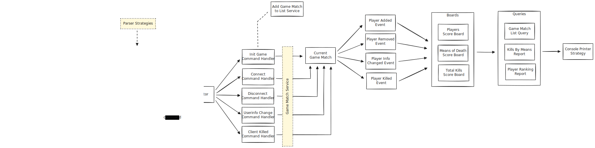

# Quake3ArenaLogAnalyzer

## Description
Quake3ArenaLogAnalyzer is a .NET Core 8.0 application written in C#, designed to analyze log lines from the Quake 3 Arena game and reconstruct player actions such as ClientConnected, ClientDisconnect, ClientKill, ClientUserinfoChanged, and InitGame.

## Architecture

## Patterns and Best Practices
- **Clean Code**: The codebase follows clean code principles to ensure readability and maintainability.
- **SOLID**: Principles of SOLID are adhered to, promoting modular and flexible code.
- **Strategy**: Utilized to encapsulate interchangeable algorithms for parsing log lines.
- **Inversion of Control (IoC)**: Dependency injection is employed to manage component dependencies and promote decoupling.
- **Mediator**: Facilitates communication between components without direct references, reducing coupling.
- **Reflection**: Utilized for dynamic inspection and invocation of types and members at runtime.
- **Command Query Separation (CQS)**: Advocates for separating methods that change state from those that return information, enhancing clarity and maintainability.
- **Template Method**: Used to define the skeleton of an algorithm in the base class and allow subclasses to override specific steps.
- **Object-Oriented Design**: Emphasizes encapsulation, inheritance, and polymorphism to model the problem domain effectively.
- **Domain-Driven Design (DDD)**: Focuses on creating a rich domain model that reflects real-world concepts, behaviors, and interactions.
- **Unit Testing**: Test-driven development approach with a suite of unit tests to ensure code correctness and robustness.

## Build Instructions via Docker
1. Make sure Docker is installed on your system.
2. Navigate to the root of the repository where Dockerfile and docker-compose.yaml are located.
3. Run the following command to build the Docker image: `docker-compose build`
4. Once the build process is complete, you can run the application using Docker: `docker-compose up`
5. Check the log analysis results as needed.